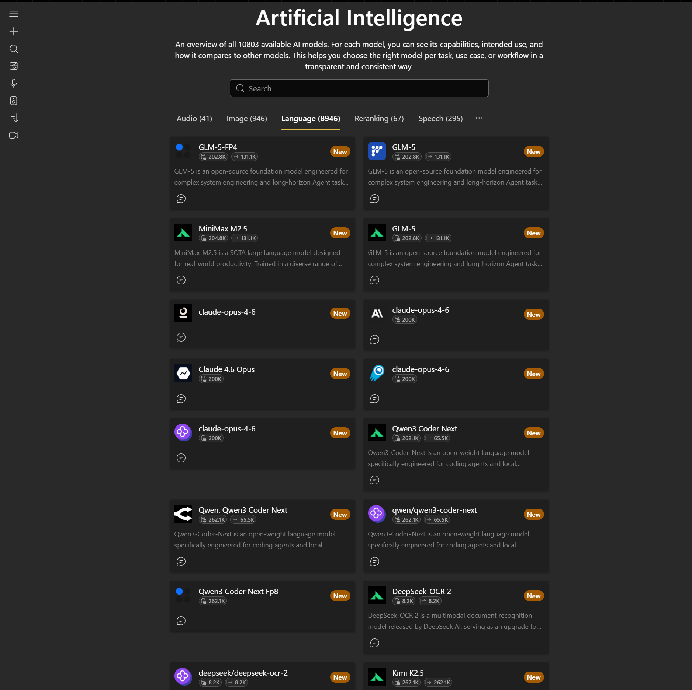

# aihappey-chat

[](https://chat.aihappey.com)

**Open-source AI chat client with streaming chat, provider switching, tools, MCP, attachments, and rich message rendering.**

[Open the live app](https://chat.aihappey.com) · [Watch Streaming UI demo](https://github.com/achappey/aihappey-chat/raw/main/videos/StreamingUI.mp4) · [Storybook Chat](https://achappey.github.io/aihappey-chat/storybook-chat) · [Storybook Themes](https://achappey.github.io/aihappey-chat/storybook-themes)

---

## What is this?

`aihappey-chat` is a client-side AI chat app. It gives users one interface for normal chat, model/provider switching, MCP tools, file attachments, structured output, and rich responses.

The app does not own a backend. You point it at compatible APIs and MCP catalogs.

## Highlights

- Streaming chat replies with rich message rendering.
- Provider and model switching in the same chat experience.
- Built-in model explorer and AI mesh views.
- MCP tools/resources and tool-call inspection.
- Streaming UI apps/cards for dashboards, forms, and structured output.
- File attachments and rich content such as markdown, code, charts, PDFs, images, and 3D output.
- Optional speech, transcription, reranking, remote storage, and authentication integrations.
- Multiple theme implementations, including Fluent, Bootstrap, Mantine, Material, Chakra, and Shadcn.

## Chat endpoints

The core chat app can send chat requests to multiple backend shapes. The selected endpoint is configured with `DEFAULT_CHAT_ENDPOINT` in the sample app or with `chatConfig.defaultChatEndpoint` when embedding the core package.

Supported chat endpoints:

| Endpoint | Purpose | Request shape |
| --- | --- | --- |
| `POST /api/chat` | Default chat endpoint | Vercel AI SDK compatible streaming chat body |
| `POST /v1/chat/completions` | OpenAI-compatible chat completions endpoint | Native chat completions body |
| `POST /v1/responses` | OpenAI-compatible responses endpoint | Native responses body |
| `POST /v1/messages` | Anthropic-compatible messages endpoint | Native messages body |

All four endpoint modes share the same UI features where possible. The native endpoint mappers translate UI messages, system prompts, text parts, and supported attachments into each provider-style request.

### Provider options / metadata

Chat settings are forwarded with the metadata field expected by each endpoint shape:

- `POST /api/chat` receives `providerMetadata` in the Vercel AI SDK style request body.
- `POST /v1/chat/completions`, `POST /v1/responses`, and `POST /v1/messages` receive the same provider settings as top-level `metadata`.

This keeps provider-specific settings consistent while using the correct wire field for `/api/chat` and native provider-style endpoints.

## Backend compatibility

This repository is client-side only. A deployment usually provides:

- A chat backend at `API_BASE_URL` supporting at least one of the chat endpoints above.

Optional backends:

- Remote conversation storage.
- Transcriptions.
- Entra ID authentication.
- Agent chat. Agent mode still calls `${AGENT_ENDPOINT}/api/chat`.

Streaming expectations:

- `/api/chat` should return a Vercel AI SDK compatible stream.
- `/v1/chat/completions`, `/v1/responses`, and `/v1/messages` should return provider-style streaming events that the client normalizes into the chat UI stream.

## Configuration

The sample app reads configuration from `samples/chathappey/.env`.

Important variables:

- `APP_NAME`: display name for the app.
- `API_BASE_URL`: base URL for chat and related APIs, for example `http://localhost:3010`.
- `DEFAULT_CHAT_ENDPOINT`: default chat endpoint. Use `/api/chat`, `/v1/chat/completions`, `/v1/responses`, or `/v1/messages`.
- `AGENT_ENDPOINT`: agent backend base URL. Agent mode calls `${AGENT_ENDPOINT}/api/chat`.
- `APPLICATIONINSIGHTS_CONNECTION_STRING`: optional monitoring configuration.

See [`samples/chathappey/.env.example`](samples/chathappey/.env.example) for the current sample values.

## Screenshots

<p align="center">
  
  
  
</p>

1. **AI model explorer**: browse and filter models by modality and capabilities.
2. **AI mesh**: inspect how providers and models are connected.
3. **Streaming UI**: see response parts and UI updates as they arrive.

## Local development

1. Install dependencies:

   ```bash
   npm install
   ```

2. Create local sample configuration:

   ```powershell
   Copy-Item samples/chathappey/.env.example samples/chathappey/.env
   ```

3. Run package/watch build from the repository root:

   ```bash
   npm run dev
   ```

4. In another terminal, run the sample app:

   ```bash
   npm run -w samples/chathappey serve
   ```

## Developer notes

- Core chat integration uses Vercel AI SDK primitives and a normalized transport layer.
- `useChat` is re-exported via [`packages/aihappey-ai/src/index.ts`](packages/aihappey-ai/src/index.ts).
- Main chat wiring lives in [`packages/aihappey-core/src/features/chat/engine/VercelChatInner.tsx`](packages/aihappey-core/src/features/chat/engine/VercelChatInner.tsx).
- Native endpoint request mapping lives in [`packages/aihappey-core/src/features/chat/engine/genericEndpointMappers`](packages/aihappey-core/src/features/chat/engine/genericEndpointMappers).
- Playground endpoint request builders live in [`packages/aihappey-clients/src/endpoints`](packages/aihappey-clients/src/endpoints).

Monorepo highlights:

- [`packages/aihappey-core`](packages/aihappey-core): runtime logic and rich content.
- [`packages/aihappey-components`](packages/aihappey-components): reusable UI components.
- [`packages/aihappey-clients`](packages/aihappey-clients): endpoint/client adapters for playground and provider-style APIs.
- [`packages/aihappey-mcp`](packages/aihappey-mcp): MCP client.
- [`samples/chathappey`](samples/chathappey): reference app.
- [`samples/bootstrap-sample`](samples/bootstrap-sample): Bootstrap-flavored sample.

